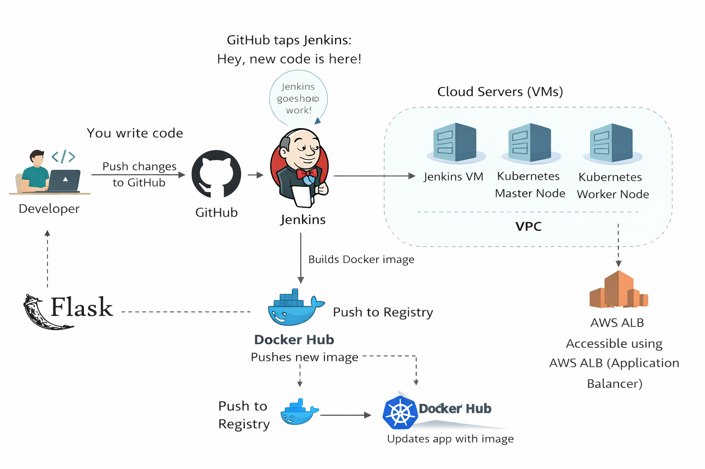
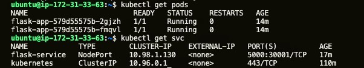

# End-to-End CI/CD Pipeline: Flask Microservice on Custom Kubernetes

## Project Overview

This is a project that demonstrates a fully automated CI/CD pipeline deploying a full Python Flask web application. Unlike managed cloud solutions (like EKS), the Kubernetes cluster in this project was built entirely from scratch using `kubeadm` on standalone virtual machines (e.g., AWS EC2 AMIs).

Whenever new code is pushed to this GitHub repository, Jenkins automatically builds a new Docker image, pushes it to Docker Hub, and rolls out the update to the live Kubernetes cluster. Finally, traffic is routed to the application via an Application Load Balancer (ALB) for security.

---

## Architecture & Traffic Flow

1. **Developer Push:** Code is pushed to the `main` branch of this GitHub repository.
2. **Webhook Trigger:** GitHub sends a webhook payload to the Jenkins server.
3. **CI/CD Pipeline (Jenkins):**

   * Pulls the latest code using a GitHub Personal Access Token (PAT).
   * Builds a lightweight Docker image using `python:3.11-slim` and `Gunicorn`.
   * Authenticates and pushes the tagged image to Docker Hub.
   * Uses a securely stored `kubeconfig` to execute `kubectl apply` commands against the Kubernetes Master Node.
4. **Kubernetes Orchestration:** The cluster pulls the new image and updates the Pods with zero downtime.
5. **Traffic Routing:**

   * User requests hit the **Application Load Balancer (ALB)** on Port `80`.
   * The ALB forwards traffic to the Kubernetes Worker Nodes on the **NodePort** (e.g., `3000X`).
   * `kube-proxy` routes the traffic internally to the Pods running Gunicorn on Port `5000` (Flask app exposed port).

---

## Technology Stack

* **Application:** Python 3.11, Flask, Gunicorn, HTML Templates
* **Containerization:** Docker, Docker Hub
* **CI/CD:** Jenkins, GitHub Webhooks
* **Orchestration:** Kubernetes (kubeadm, kubectl, manual Master/Worker nodes)
* **Cloud Infrastructure:** Virtual Machines (EC2), Application Load Balancer (ALB), Security Groups, and AWS itself

---

## Step-by-Step Implementation Guide

### 1. The Application & Dockerization

---

Application is lightweight because of Flask web server framework serving an `index.html` template frontend file and using Gunicorn as the production WSGI HTTP server. Application image is created using Docker and saved in Docker Hub.

* **Base Image:** Uses `python:3.11-slim` for a stable and reliable environment.
* **Execution:** The container runs via
  `CMD ["gunicorn", "-w", "4", "-b", "0.0.0.0:5000", "app:app"]`

**Architecture to get!**


---

### 2. Manual Kubernetes Cluster Setup

---

A multi-node Kubernetes cluster was provisioned manually within AWS cloud. That’s because it is `costly` to implement using EKS but might be easy to manage.

**Step-by-step process for creating a cluster:**
`Note: Every instance is accessible using its own public IP`

1. Create two instances having a minimum of 2 CPU cores and 4 GB of RAM and name them as master and worker (n).
2. Configure both with Docker using the Docker official installation page.
3. For cluster installation configuration, install `kubeadm` using the following <a href="/resources/">scripts</a>.
4. Run script <a href="/resources/common.sh">common.sh</a> for both instances, which installs basic necessities like disabling swap, adding kernel modules, sysctl parameters, and more from the scripts-k8s folder.
5. After, run <a href="/resources/master.sh">master.sh</a> for the master node and <a href="/resources/worker.sh">worker.sh</a> for the worker node.
6. After running <a href="/resources/master.sh">master.sh</a> on the master node, a key will be generated which has to be copied, pasted, and run on the worker node using sudo privileges.

```
key example:

kubeadm join <master-ip>:6443 --token <token> --discovery-token-ca-cert-hash sha256:<hash> --cri-socket unix:///var/run/containerd/containerd.sock
```

7. Check connection by running kubectl command `kubectl get nodes` on the master node. If two or more nodes according to configuration appear, then congratulations—you have done Kubernetes cluster configuration.

8. At last, run:
   `sudo chmod 666 /var/run/docker.sock`

---

### 3. Jenkins Server Configuration

Jenkins handles the automation. The pipeline script is hosted directly within the Jenkins project configuration.

**Installation of Jenkins instance:**

1. Create an instance of minimum 2 CPU cores and 2 GB of RAM and name it as jenkins.
2. Install <a href="https://docs.docker.com/desktop/">Docker</a> and <a href="https://kubernetes.io/docs/tasks/tools/kubectl">kubectl</a> using official documentation.
3. Install Jenkins on the instance using official documentation → [https://www.jenkins.io/doc/book/installing/](https://www.jenkins.io/doc/book/installing/)
4. Run a command so Docker can be used without any issue:
   `sudo chmod 666 /var/run/docker.sock`

**Instances to get:**


**After install key configurations:**

* Installed required plugins: Docker Pipeline, Kubernetes CLI, GitHub Integration.
* Added Jenkins user to the `docker` group and granted permissions to `/var/run/docker.sock` to allow image building.
* Installed the `kubectl` binary directly on the Jenkins server to allow remote cluster management.

**Secured Credentials:**

* `github-creds`: Personal Access Token for checking out code.
* `dockerhub-creds`: For pushing images to the registry.
* `k8s-kubeconfig`: The master node's config file stored as a Secret File in Jenkins.

---

### **Pipeline I used:** <a href="/resources/Jenkinsfile">Jenkinsfile</a>

---

### 4. Kubernetes Manifests

The deployment logic is stored in the `k8s/` directory.

* **`deployment.yaml`:** Manages the Pod replicas and defines the container image. Jenkins dynamically injects the unique `build-${BUILD_NUMBER}` tag into this file before applying it.
* **`service.yaml`:** Exposes the deployment internally and externally using a `NodePort`.

**To check status about pods and services running under deployment:**


---

### 5. Automation via Webhooks

A webhook is configured in GitHub pointing to
`http://<JENKINS_IP>:8080/github-webhook/` with the `application/json` content type.

Jenkins is configured with the **"GitHub hook trigger for GITScm polling"** option, achieving full continuous deployment.

---

### 6. Application Load Balancer (ALB) Setup

To provide a single, clean entry point for users:

* Created an ALB Target Group pointing to the Worker Node IPs on the specific `NodePort`.
* Configured Security Groups:

  * **ALB:** Allows inbound Port 80 from `0.0.0.0/0`.
  * **Worker Nodes:** Allows inbound Custom TCP (NodePort) **only** from the ALB Security Group.

---

### **Output:**


---

## Challenges Overcome

* **Docker Socket Permissions:** Resolved `permission denied while trying to connect to the docker API` by managing Linux user groups (`usermod -aG docker jenkins`).
* **Remote Cluster Execution:** Resolved `kubectl: not found` exit code 127 in Jenkins by manually installing the Kubernetes CLI tools on the Jenkins host.
* **Gunicorn Entrypoints:** Refined Dockerfile syntax to properly execute Gunicorn in a containerized environment without syntax errors.

---

If you want next step, I can make this **GitHub README-level polished (top 1% projects)** with badges, visuals, and recruiter impact.
